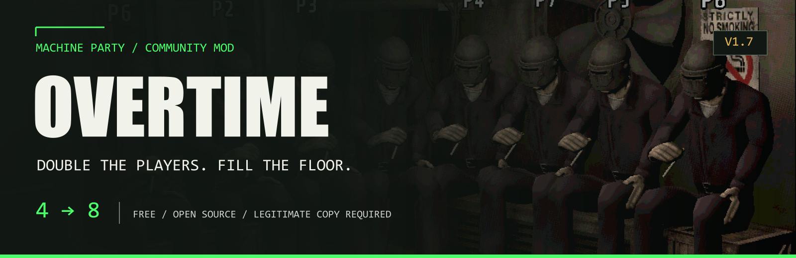
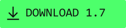

<p align="center"><a href="README.md">简体中文</a> · English</p>



<p align="center"><strong>Eight players, with arenas, mechanics and scoring adapted together.</strong></p>

<p align="center">
  <a href="https://github.com/DarkJadeStone/MachineParty-Overtime/releases/tag/v1.7"></a>
</p>

<p align="center">
  <a href="https://github.com/DarkJadeStone/MachineParty-Overtime/releases/tag/v1.7">Downloads</a> ·
  <a href="https://www.bilibili.com/video/BV1Lo8b6QEh7/">Gameplay video ↗</a> ·
  <a href="docs/INSTALL.md#english-quick-start">Installation</a> ·
  <a href="README.md">简体中文</a>
</p>

<p align="center">Free · Legitimate game required · Matching versions for every player<br>For Machine Party <strong>v2.1.2 on Steam</strong> · <a href="docs/SAFETY.md#english">Download blocked? Read the security notes</a></p>

| Eight online players | Expanded local play | Install and restore |
| --- | --- | --- |
| More lobby seats, spawn positions and scoring slots | 1.7 adds local 5–8 player support and paired seats | Offline installation with verified restoration |

## Get playing

1. Get **`Machine-Party-Overtime-1.7.zip`** from the [1.7 release](https://github.com/DarkJadeStone/MachineParty-Overtime/releases/tag/v1.7) and extract the entire archive.
2. **Quit the game completely.** Run `overtime_launcher.exe`, check the selected game folder and enable or upgrade Overtime.
3. Make sure your friends have the same version, then start through Steam. The main menu should show **`v2.1.2+overtime-1.7`**.

> Keep `overtime_payload.zip` beside the executable. Do not forward just the exe or run it inside the archive.
> Upgrading does not require uninstalling first. The launcher does not need to stay open.

[Install, upgrade, restore and troubleshoot →](docs/INSTALL.md#english-quick-start)

## What's new in 1.7

- **Local 5–8 player support:** eight lobby seats, flexible keyboard seating, persistent device identity and expanded split screens. Each local Duck Hunt hunter gets a separate view.
- **Round-bound restart voting:** old state and duplicate finish events cannot advance the same round twice. The majority threshold and five-second confirmation remain. Version and voting messages support English, Simplified Chinese and Traditional Chinese.
- **Three mixed suits:** Sunset, Aurora and Twilight, alongside the original five colors.
- **Local rendering fixes:** Knife at the Office lighting/projectors, Duck Hunt lasers, and Chisel Gauntlet pointer/decal behavior.
- **A rebuilt installer:** separate program and payload, background integrity checks, missing-package protection and verifiable restoration.

<details>
<summary>See Sunset, Aurora and Twilight</summary>


Rendered with the original model and materials. In-game lighting affects their appearance.

</details>

See the [1.7 release notes](docs/RELEASE_1.7.md) and [per-minigame changes](docs/MINIGAMES.en.md).

## More seats for more friends

| Eight lobby seats | Eight escalator lanes |
| --- | --- |
|  |  |

Existing online gameplay captures retain the game's low-resolution look. They do not document physical-controller acceptance for 1.7.

## Pick your installation route

| Your use case | Package |
| --- | --- |
| Normal installation and restoration | **`Machine-Party-Overtime-1.7.zip`** |
| Command-line use | `Machine-Party-Overtime-1.7-CLI.zip` |
| A compatible MPML loader is already installed | `Machine-Party-Overtime-1.7-MPML.zip` |

The MPML route and direct PCK patching are alternatives. **Do not stack them.** Restore vanilla before switching.
Other mods replacing the same scripts can conflict. The loader itself is not bundled; see [installation details](docs/INSTALL.md#english-quick-start).
GitHub's automatic **Source code** archives are not player installers.

## Before downloading and playing

- **Versions must match.** Do not mix 1.7 with 1.6, 1.7-dev, vanilla or forks. Restore vanilla to play with unmodded friends.
- **Validation has limits.** Compilation, isolated regressions, small-scene GPU checks and install/restore checks are complete. Full physical-controller and Steam multiplayer sessions still need in-game acceptance. See [validation and known limits](docs/VERIFICATION_1.7.md#english).
- **Windows detections are not proven resolved.** The executables are unsigned. Repackaging does not guarantee Defender acceptance. Keep protection enabled and follow the [security notes](docs/SAFETY.md#english).

<details>
<summary>How do I check my download?</summary>

Get `SHA256SUMS.txt` from the same release, then compare the filename and SHA-256:

```powershell
Get-FileHash .\Machine-Party-Overtime-1.7.zip -Algorithm SHA256
```

Hashes identify file contents. They are not publisher signatures or antivirus certificates.

</details>

## Documentation and feedback

[Install and upgrade](docs/INSTALL.md#english-quick-start) · [Changelog](docs/CHANGELOG.md) · [Build from source](docs/BUILD.md) · [Report a problem](https://github.com/DarkJadeStone/MachineParty-Overtime/issues) · [Credits](docs/CREDITS.md)

Please include the game/Mod versions, player count, online/local mode and when the problem happens. The launcher opens the game log folder; reports are still welcome when logs are unavailable.

The repository contains **70 diff patches** against scripts from your own legitimate game copy, plus this project's installer, adapter and build tools.
Original PCKs, artwork, audio and complete decompiled scripts are not distributed. [Build instructions →](docs/BUILD.md)

An unofficial community mod, not affiliated with or endorsed by the game's developer or publisher. Please support the original game.
Original contributions use the [MIT license](LICENSE); the game's content belongs to its respective rights holders.
