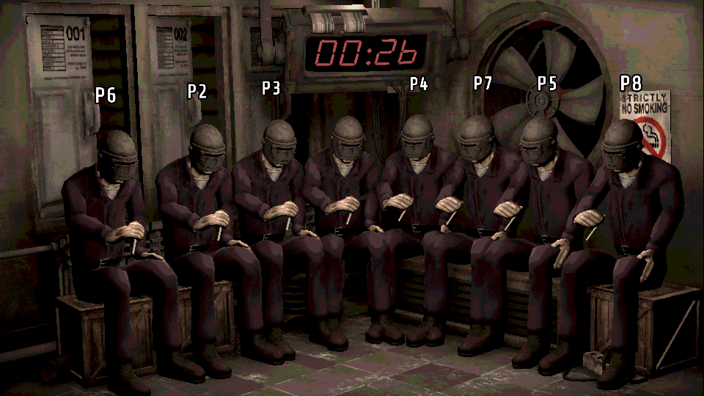
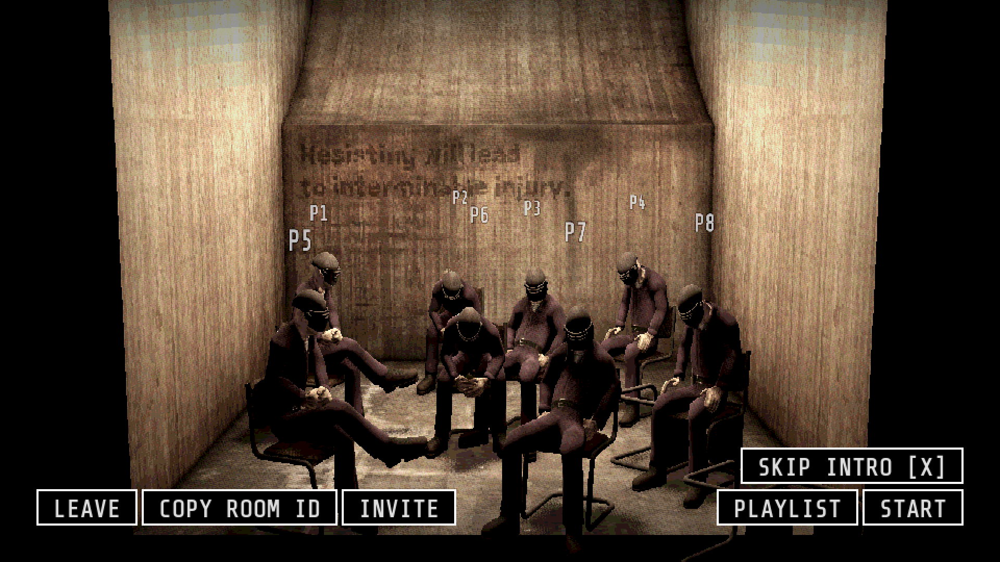
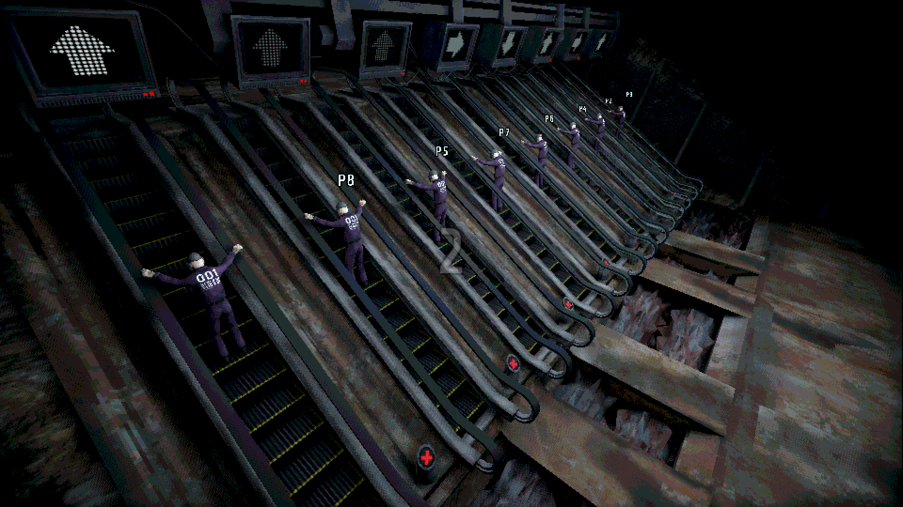
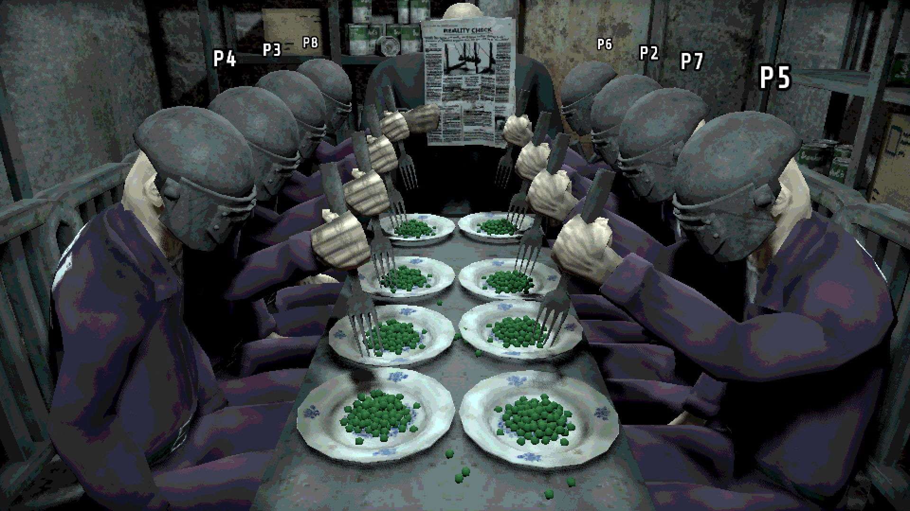
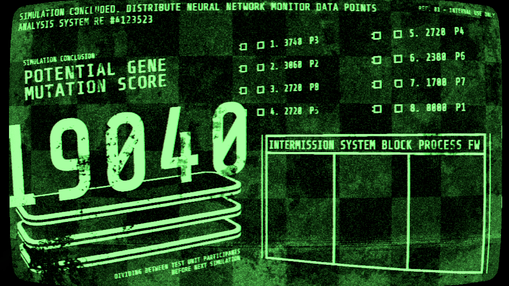

# Machine Party-Overtime

把《Machine Party》（机械狂欢）的联机上限提到 **8 人** —— 并且逐个小游戏重做了场地、算分
与部分玩法，不只是把人数常量改大。免费、开源、可自己编译。

> ## ⚠️ 本 mod 完全免费。如果你为它花过钱，说明你被骗了。
> **This mod is completely FREE. If you paid for it, you were scammed.**
> 只从本仓库的 [Releases](../../releases) 页面下载；任何人都无权拿它收费。

> **English**: An open-source mod that raises the multiplayer cap of *Machine Party* from 4 to 8
> players — and reworks arenas, scoring and some mechanics per minigame to make eight actually work. It patches only the game's own scripts — **no game assets are redistributed**, and you
> must own a legitimate copy. Download the installer from the
> [Releases](../../releases) page, run it, and it patches your local copy (with an automatic
> backup and one-command uninstall). Everyone in a lobby must install the **same** version.
> See [`docs/MINIGAMES.en.md`](docs/MINIGAMES.en.md) for a per-minigame changelog and
> [`docs/BUILD.md`](docs/BUILD.md) to build it yourself. Not affiliated with or endorsed by
> the game's developer or publisher.

---



| | |
| --- | --- |
|  |  |
|  |  |

<sub>实机截图（1920×1080，未修图）。上：吸烟小憩。左上起顺时针：大厅席位、扶梯深渊、
结算榜、餐桌礼仪。**场地是重做的，不是把人数常量改大** —— 座位、餐位、扶梯、
名次槽都实打实扩到了 8 套。</sub>

<sub>*Real in-game captures, unretouched. Arenas are rebuilt, not just a constant bumped:
seats, place settings, escalator lanes and scoreboard slots are all genuinely extended to
eight.*</sub>

---

## 更新日志

### 1.2 —— 修好了两个会卡死整局的 bug，顺带把重复音效压下去

**内部暗手：拿到针筒的人再拿到一支，整局会卡死。**
猎杀阶段永远不开始 —— 扎不了人、其他人的视角不会拉近、灯也不会关，
而那支针已经从柜子里被取走了，场上再没有第二支可找，只能干等到超时。
根因是「已找到的针筒数」被按**人**去重了，而它本该按**针**计数。

**残骸平台：后半局不再掉石头。**
停在平台上不动的残骸永远不会被回收（原版唯一的回收口是「掉出平台」），
攒够 40 块之后就一块都不再掉，这一局的玩法直接消失。
8 人局尤其严重：掉落点是每人一个，一个 tick 就投 8 块，十几秒就能把池子掏空。
现在静止超过 1 分钟的残骸会被主动回收并重新投放。

**重复音效。** 多处音效由 8 台机器各广播一遍，每台最终叠着播 8 声
（心电图滴答、换弹、拾枪、死亡音、送货区指示灯）。现在每端各响一声。
顺带修掉「内部暗手一次搜索被算 7 次」的连锁广播。

⚠️ **1.2 与 1.1 不能互通**：版本号写进了联机握手，一起玩的人都要更新。
（主菜单右下角会显示 `v2.1.2+overtime-1.2`，一眼能对。）

> **English — 1.2: two game-breaking hangs fixed, plus duplicated sound effects.**
> **Inside Job**: if the player who already held a syringe picked up the second one, the hunt
> phase never started — nobody could stab, cameras never zoomed, lights never went out, and
> the round could only time out. The syringe counter was de-duplicated per *player* when it
> should have counted per *syringe*. **Debris Platforms**: debris that came to rest on the
> platform was never recycled (the only recycler was "fell off the platform"), so after 40
> pieces nothing dropped for the rest of the round — much worse at 8 players, where every
> player is a spawn point. Debris idle for over a minute is now actively recycled.
> **Duplicated SFX**: several sounds were broadcast once per machine and played 8 times over
> on every client; now once each. **1.2 is not compatible with 1.1** — everyone in the lobby
> has to update.

---

### 1.1 —— 修好了「房主和客机看到的场地不一样」

6 人局与 5 人局实测报出来的三处**主客机不同步**，全部修好。
三处的共同点：那些东西是**每台机器各自摆的**，而摆的依据只有房主有 ——
所以两边都不报错，只能靠人对着画面才看得出来。

| 小游戏 | 之前是什么样 |
| --- | --- |
| **枪械工厂** | 房主看到的走道是空的，**其他人的走道中间杵着一张桌子，还挡路**（有碰撞） |
| **凿刻考验** | 记忆阶段（看巨幕）房主视野里其他人会隐身让开，**其他人看到的还是一排后脑勺** |
| **吸烟小憩** | 8 个座位和两个木箱的摆位，房主和其他人不是同一套 |

⚠️ **1.1 与 1.0 不能互通**：版本号写进了联机握手，一起玩的人都要更新。
（主菜单右下角会显示 `v2.1.2+overtime-1.1`，一眼能对。）

> **English — 1.1: fixed the host seeing a different arena from everyone else.**
> Three desyncs found in real 5- and 6-player sessions. All three came from props that each
> machine places locally from data only the host had, so nothing errored — you could only
> catch it by comparing screens. **Manufacture Gun**: clients had an extra solid workbench
> blocking the walkway. **Chisel Gauntlet**: during the memorise phase other players only
> vanished on the host's screen. **Smoke Break**: seats and crates were laid out differently
> for the host and everyone else. **1.1 is not compatible with 1.0** — the version string is
> part of the multiplayer handshake, so everyone in the lobby has to update.

---

## 这是什么

原版联机上限 4 人。这个 mod 把上限改成 8 人，并且**逐个小游戏做了 8 人适配** ——
不是简单地把人数常量改大（那样大部分小游戏会当场崩，或者出现两个人叠在同一个出生点、
第 5~8 名看不到自己得分之类的问题）。

15 个可玩小游戏全部动过：出生点补位、道具/装置数量、场地摆位、算分名次、
记分板位数、大厅席位与座椅。

**适用游戏版本：v2.1.2（Steam）。** 游戏更新后不要硬装 —— 安装器会校验，
版本对不上会拒绝安装并告诉你原因，不会把你的游戏搞坏。

## 怎么装

到 [Releases](../../releases) 下载 **`Machine-Party-Overtime-x.y.zip`**，解压后
**完全退出游戏**，运行里面的 **`overtime_launcher.exe`**，点「启用 Overtime」。
装好后主菜单右下角版本号会变成 `v2.1.2+overtime-x.y`。

压缩包里只有两样东西：**启动器**（单文件，不需要装任何运行库）和一份说明。

**启动器不需要常驻** —— Overtime 不是运行时加载的，启用一次就改写完了，
之后**照常从 Steam 启动游戏**；启动器上那个「启动游戏」按钮只是顺手。
只有想切回原版、切回 Overtime、或看当前状态时才需要再打开它。

**切换是一秒钟的事**：还原数据只有几 KB（做法见下面「怎么做到的」），
想跟没装 mod 的朋友玩就点一下切回原版，玩完再点回来。
切回原版后程序会校验结果与原版**逐字节相同**才算成功。

完整说明（含 Windows SmartScreen 提示怎么过、手动指定游戏目录、常见问题）见
[`installer/README.md`](installer/README.md)。

### 三件必须知道的事

1. **你必须自己有正版游戏。** 安装器里没有任何游戏文件，它是在你自己那份游戏上打补丁。
2. **一起玩的人必须都装，而且是同一版。** 版本号会被写进联机握手，对不上会被房主直接拒绝
   —— 这是故意的：装了和没装的混在一起玩，会在半局中间以很难查的方式出问题。
   代价是**装了 mod 就不能和原版朋友一起玩**，想一起玩就先 `--uninstall`。
3. **随时能还原**，而且是精确还原（下面这段解释为什么只要几 KB）。

### 怎么做到「还原只存几 KB」

打补丁的做法是**把新内容追加到数据包末尾，再把索引里那一条指过去** ——
原文件的字节一个都没被覆盖，还躺在包里。所以还原不需要 605 MB 的整包备份，
只要把索引那几个字段写回去、再把文件截断回原长度就行。

这样做反而**更安全**：还原完可以直接算 SHA256 跟原版指纹比对，
**能证明是逐字节精确的**；整包拷贝反而没有这个保证。
而且还原之前会先逐条确认「现在这份包正是我改过的那一份」——
对不上（Steam 更新过、或你点过「验证游戏文件的完整性」）就拒绝动手，绝不瞎写。

## 已知限制（装之前就该知道）

| 项 | 说明 |
| --- | --- |
| **暂不兼容 mod loader 及其他改 PCK 的 mod** | 本 mod 靠重打游戏数据包（`.pck`）安装，**跟 [MachinePartyModLoader](https://github.com/Krunk-theduck/MachinePartyModLoader) 等同样改 PCK 的工具互斥，请二选一**。原因见下 |
| 角色配色只有 5 种 | 游戏自带 5 个颜色，8 人局**必然有人重色**。mod 没有加新颜色 |
| 局时变长 | 淘汰制小游戏人多则轮数多。人工筛选 8 人最多 7 轮，整局时长约为 4 人局的两倍 |
| 部分小游戏在 4 人以下也有视觉变化 | 少数小游戏的场地扩充没有按人数设闸门，2~4 人局会看到多出来的椅子/平台。不影响玩法 |
| 猎鸭 8 人是「6 鸭 2 猎」 | 原版是 3 鸭 1 猎。8 人保持同样的比例，不是 7 鸭 1 猎 |
| 摄像机偶尔拍到布景外 | 部分小游戏为容纳 8 人把镜头拉远，边角可能露出原本在取景框外的布景 |

### 为什么不能跟 mod loader 共存

人数上限写在 `const MAX_PLAYERS` 里，而 **GDScript 的常量是编译期内联的** —— 每一个调用点在编译时就把 `4` 焊死了，运行时没有任何办法改它，只能替换数据包里已编译的字节码。所以本 mod 只能走"重打 PCK"这条路。

而 MachinePartyModLoader 那类加载器是用 `extends` 继承原脚本来做覆盖 —— 这个设计在多 mod 叠加上明显更好，**但继承够不到一个已经内联的常量**：子类里声明 `MAX_PLAYERS = 8`，改不了那些已经编译进 `4` 的代码。

这是结构性冲突，不是打个补丁能绕过去的。**如果有办法在脚本首次加载前替换掉整个编译后的资源（而不是继承它），我很乐意改成散装文件的 mod** —— 欢迎来 [issue](../../issues) 里告诉我。

## 仓库里有什么（以及为什么不是完整脚本）

```
patches/      51 个差异补丁（.patch），相对游戏自己的脚本
installer/    单文件安装器的完整 C# 源码
tools/        构建链：打补丁 → 编译 → 出 exe
docs/         逐个小游戏的改动说明、构建说明、迁移到新版本的说明
```

**想知道具体改了什么玩法？** 看 [`docs/MINIGAMES.md`](docs/MINIGAMES.md) ——
15 个小游戏逐个写明：为了 8 个人改了什么、得分动没动、哪些是故意保持原版的。
（English: [`docs/MINIGAMES.en.md`](docs/MINIGAMES.en.md)）

**为什么发的是差异补丁而不是完整的 `.gd` 文件**：那 51 个文件是「游戏反编译源码 +
我们的改动」混在一起的（合计约 31,000 行），完整发出来等于公开约 14,300 行游戏自己的源代码。
本项目的红线是**不分发游戏原始资产**，所以只发我们自己写的那部分（16,746 行）
加上必要的上下文。

你拿自己那份正版解包出脚本，跑一条命令就能把补丁打上，得到的结果与作者本机
**逐字节相同**（出包时每次都会自动验证这一点）。步骤见
[`docs/BUILD.md`](docs/BUILD.md)。

## 自己编译

```powershell
# 1. 用自己那份游戏解包出原版脚本（需要 gdre_tools v2.6.4）
# 2. 打补丁
powershell -ExecutionPolicy Bypass -File tools\apply_patches.ps1
# 3. 编译
powershell -ExecutionPolicy Bypass -File tools\build.ps1 -CompileOnly
# 4. 出安装器
powershell -ExecutionPolicy Bypass -File tools\build_installer.ps1
```

细节、前置条件和常见报错见 [`docs/BUILD.md`](docs/BUILD.md)。
游戏出新版本后怎么迁，见 [`docs/UPDATING.md`](docs/UPDATING.md)。

## 红线（本项目的自我约束）

- **只服务正版。** 不做任何让盗版联机的东西。
- **不分发游戏原始资产。** 不发美术、音频、场景、完整脚本、数据包。
- 不碰游戏 exe、不碰 Steam 相关的 dll、不改成就逻辑、不动任何与付费/授权相关的东西。

## 授权与声明

代码授权见 [`LICENSE`](LICENSE)（MIT，覆盖本仓库中我们自己写的部分）。

本 mod 是**非官方**的第三方修改，与游戏的开发商、发行商无任何关系，未获其背书。
游戏本身的代码与资产版权归其权利人所有。

出了任何问题，请先 `--uninstall` 还原成原版再向游戏官方反馈 ——
**不要拿装了 mod 的状态去给官方报 bug。**

如果权利人希望本仓库下架，请在 Issues 里提出，会配合处理。
