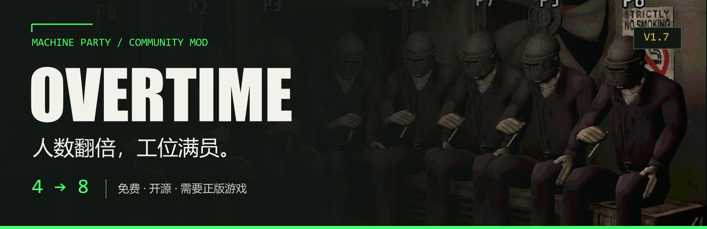
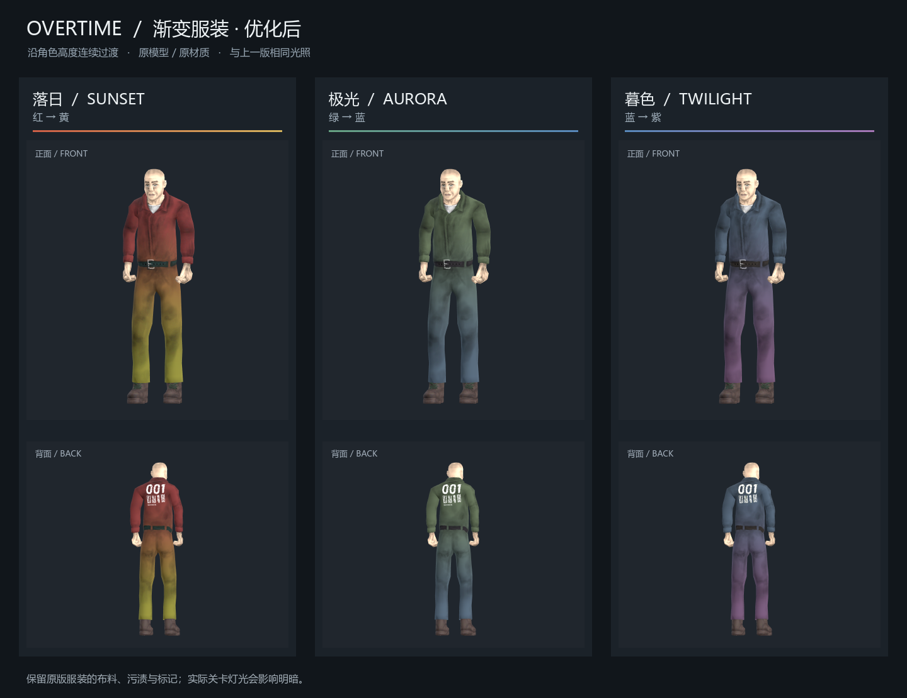
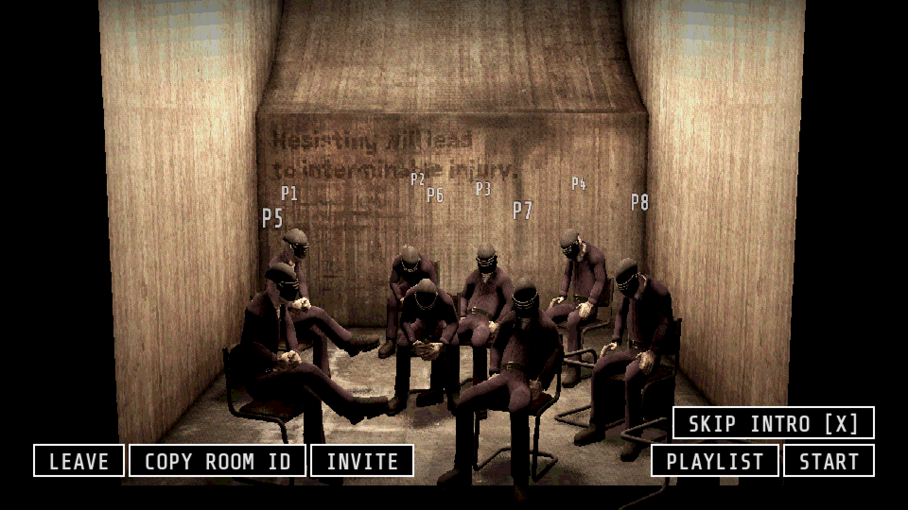
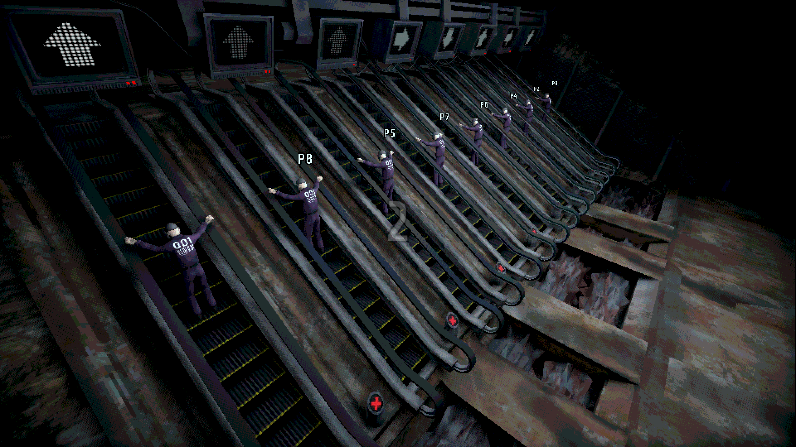

<p align="center">简体中文 · <a href="README.en.md">English</a></p>



<p align="center"><strong>《机械狂欢》八人扩展，场地、玩法与计分一起适配。</strong></p>

<p align="center">
  <a href="https://github.com/DarkJadeStone/MachineParty-Overtime/releases/tag/v1.7"></a>
</p>

<p align="center">
  <a href="https://github.com/DarkJadeStone/MachineParty-Overtime/releases/tag/v1.7">下载页面</a> ·
  <a href="https://www.bilibili.com/video/BV1Lo8b6QEh7/">实机演示 ↗</a> ·
  <a href="docs/INSTALL.md">安装指南</a> ·
  <a href="README.en.md">English</a>
</p>

<p align="center">完全免费 · 需要正版游戏 · 全房间同版本<br>适用 Machine Party <strong>v2.1.2（Steam）</strong> · <a href="docs/SAFETY.md">下载被拦截？查看告警说明</a></p>

| 八人联机 | 本地同屏扩展 | 安装与还原 |
| --- | --- | --- |
| 大厅、场地、出生点和计分适配更多玩家 | 1.7 新增本地 5–8 人支持与配对席位 | 离线安装，支持切回原版并校验结果 |

## 开始游玩

1. 从 [1.7 下载页面](https://github.com/DarkJadeStone/MachineParty-Overtime/releases/tag/v1.7) 选择 **`Machine-Party-Overtime-1.7.zip`**，完整解压。
2. **完全退出游戏**，运行 `overtime_launcher.exe`，核对游戏目录并选择「启用 Overtime」或升级。
3. 确认朋友们安装了相同版本，再照常从 Steam 启动。主菜单应显示 **`v2.1.2+overtime-1.7`**。

> 程序和 `overtime_payload.zip` 必须放在一起。不要只转发 exe，不要在压缩包内运行。
> 已装旧版无需先卸载；启动器安装完成后不用常驻。

[安装、升级、卸载与常见问题 →](docs/INSTALL.md)

## 1.7 带来了什么

- **本地 5–8 人同屏**：八席大厅、任意键鼠席位、设备身份保留，以及补齐的分屏布局。猎鸭双猎人分别拥有自己的视角。
- **更清楚的回合流程**：重开投票绑定当前回合，避免旧状态和重复结束推进；仍需过半赞成、五秒确认。版本和投票提示支持英文、简体和繁体中文。
- **三套渐变外观**：落日、极光、暮色，与原有五种纯色并存。
- **同屏修复**：内部暗手的灯光与投影、猎鸭激光显示、凿刻的鼠标落点和贴花层。
- **安装器重构**：程序与补丁分离、后台完整性检查、缺包保护和可核验还原。

<details>
<summary>查看「落日 / 极光 / 暮色」</summary>



使用原版模型与材质生成的外观预览；实际关卡光照会改变明暗。

</details>

完整内容见 [1.7 更新说明](docs/RELEASE_1.7.md)，逐关玩法见 [15 个小游戏的改动](docs/MINIGAMES.md)。

## 八个工位，更多朋友

| 大厅八席 | 八条独立扶梯 |
| --- | --- |
|  |  |

既有八人联机版本的实机截图，保留游戏的低分辨率风格；不作为 1.7 实体控制器验收记录。

## 选择适合你的安装方式

| 你需要什么 | 下载哪个 |
| --- | --- |
| 普通玩家，直接启用或还原 | **`Machine-Party-Overtime-1.7.zip`** |
| 使用命令行 | `Machine-Party-Overtime-1.7-CLI.zip` |
| 已自行安装兼容 MPML | `Machine-Party-Overtime-1.7-MPML.zip` |

MPML 与启动器修改 PCK 是两条替代路线，**不能叠装**。切换前先还原游戏；修改同一脚本的其他 Mod 可能冲突。
我们不捆绑加载器。具体前提与步骤见 [进阶安装](docs/INSTALL.md#mpml-备选安装)。
GitHub 自动生成的 **Source code** 是源码压缩包，不是玩家安装包。

## 下载与游玩前请知道

- **版本要一致。** 1.7 不与 1.6、1.7-dev、原版或其他 fork 混连；想和原版朋友玩，先切回原版。
- **验收范围有边界。** 编译、隔离回归、小场景渲染和安装还原已检查；5–8 个真实输入设备及 Steam 多人的完整流程仍需实机确认。详见 [验证记录与已知限制](docs/VERIFICATION_1.7.md)。
- **Windows 告警尚未获得解决证明。** 程序未签名，重构不保证 Defender 不再拦截。请保持防护开启，按 [告警说明](docs/SAFETY.md) 反馈具体信息。

<details>
<summary>怎样核对下载文件？</summary>

从同一 Release 下载 `SHA256SUMS.txt`，在 PowerShell 中对照文件名与结果：

```powershell
Get-FileHash .\Machine-Party-Overtime-1.7.zip -Algorithm SHA256
```

哈希用于确认文件内容一致，不是发布者签名，也不等于杀毒软件检测通过。

</details>

## 文档与反馈

[安装与升级](docs/INSTALL.md) · [完整更新日志](docs/CHANGELOG.md) · [自行构建](docs/BUILD.md) · [反馈问题](https://github.com/DarkJadeStone/MachineParty-Overtime/issues) · [贡献与参考来源](docs/CREDITS.md)

反馈时请说明游戏/Mod 版本、人数、联机或同屏，以及问题发生阶段；日志可由启动器的「游戏日志」按钮找到，拿不到日志也可以描述现象。

公开仓库提供相对正版脚本的 **70 份差异补丁**及本项目安装器、适配层和构建工具。
不分发原版 PCK、美术、音频或完整反编译脚本。[源码构建流程 →](docs/BUILD.md)

本项目是非官方社区修改，未获游戏开发商或发行商背书。请支持原作。
本项目自有代码采用 [MIT 许可证](LICENSE)；原游戏内容的权利归其权利人所有。
